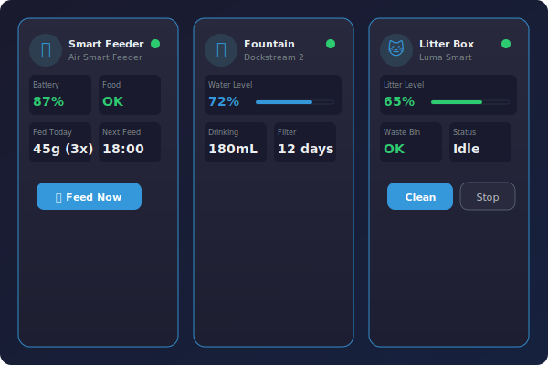

# Petlibro Cards

[![HACS][hacs-badge]][hacs-url]
[![GitHub Release][release-badge]][release-url]
[![CI][ci-badge]][ci-url]

Custom [Home Assistant](https://www.home-assistant.io/) Lovelace card for [PetLibro](https://www.petlibro.com/) smart pet devices. Auto-detects your device type and displays the appropriate UI.



## Supported Devices

| Category | Devices |
|----------|---------|
| **Feeders** | Air Smart, Granary Smart, Granary Camera, One RFID, Polar Wet Food, Space Smart |
| **Fountains** | Dockstream Smart, Dockstream RFID, Dockstream 2 Cordless, Dockstream 2 |
| **Litter Boxes** | Luma Smart Litter Box |

## Features

- Auto-detects device type from any entity
- Displays device product image from the API
- Real-time status: battery, food/water/litter levels, feeding schedule
- Basic controls: manual feed, light toggle, start clean, and more
- Visual config editor — no YAML needed
- HA native styling with theme support

## Installation

### HACS (Recommended)

1. Open HACS in Home Assistant
2. Go to **Frontend** → **+ Explore & Download Repositories**
3. Search for **Petlibro Cards**
4. Click **Download**
5. Restart Home Assistant

### Manual

1. Download `petlibro-cards.js` from the [latest release][release-url]
2. Copy to `config/www/petlibro-cards.js`
3. Add the resource in **Settings → Dashboards → Resources**:
   - URL: `/local/petlibro-cards.js`
   - Type: JavaScript Module

## Usage

Add the card via the UI card picker or use YAML:

```yaml
type: custom:petlibro-card
device_id: abc123def456  # Select via UI device picker
```

| Option | Type | Default | Description |
|--------|------|---------|-------------|
| `device_id` | string | **required** | PetLibro device ID (picked via UI editor) |
| `name` | string | auto | Override the device name |
| `show_controls` | boolean | `true` | Show control buttons |

> **Legacy support**: configs using `entity:` (any entity from the device) still work.

## Requirements

- Home Assistant 2025.4.0+
- [PetLibro integration](https://github.com/dn5qMDW3/petlibro) installed and configured

## Development

```bash
npm install
npm run build    # lint + production bundle
npm start        # dev watcher
```

[hacs-badge]: https://img.shields.io/badge/HACS-Custom-41BDF5.svg
[hacs-url]: https://hacs.xyz
[release-badge]: https://img.shields.io/github/v/release/dn5qMDW3/petlibro-cards
[release-url]: https://github.com/dn5qMDW3/petlibro-cards/releases
[ci-badge]: https://github.com/dn5qMDW3/petlibro-cards/actions/workflows/ci.yml/badge.svg
[ci-url]: https://github.com/dn5qMDW3/petlibro-cards/actions/workflows/ci.yml
